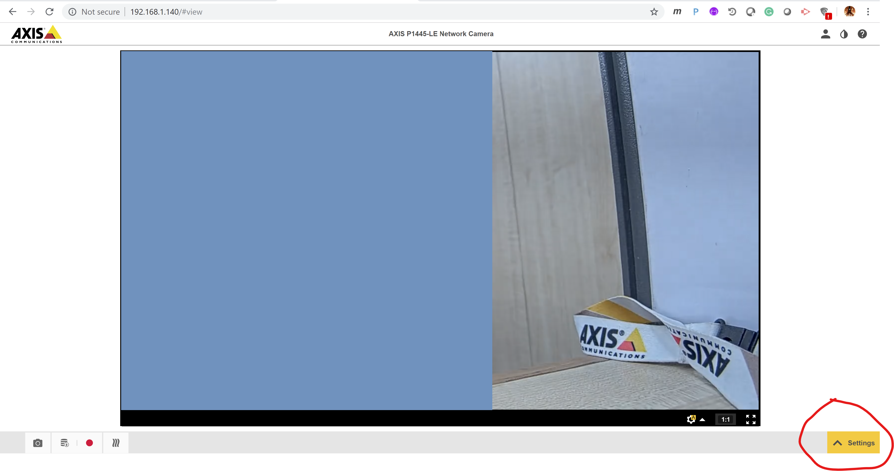
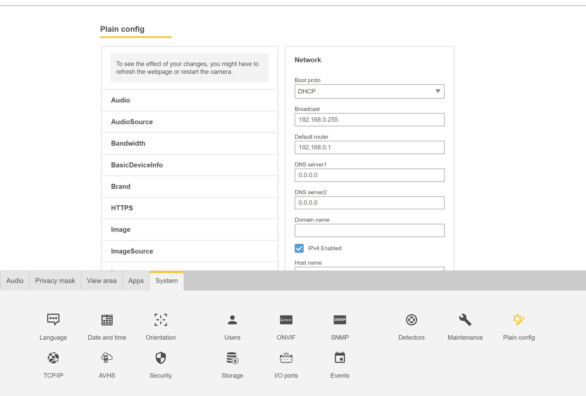
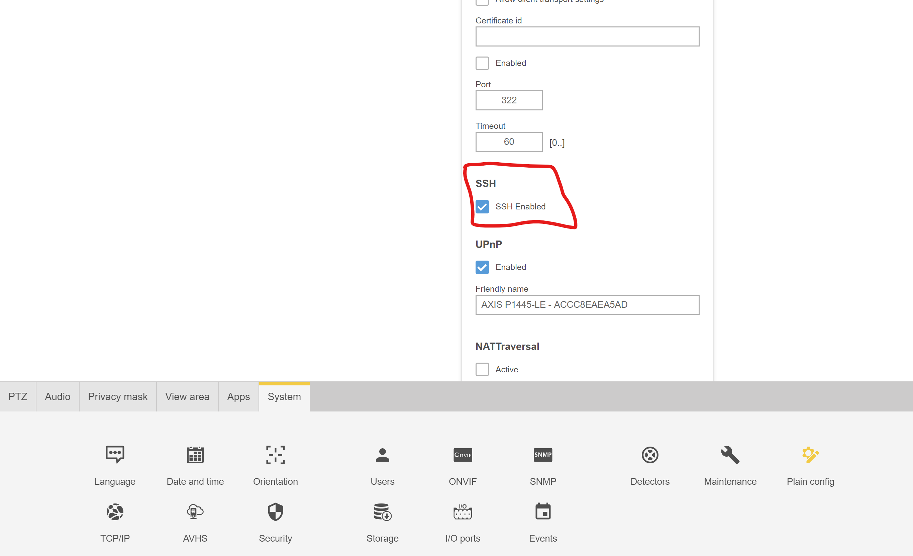

# Steps to Enable SSH on Axis Camera

- Go to Camera Settings Page 



- Go to Plain Config Page 



- Search for "SSH" and Enable SSH for Camera 



- You can also use VAPIX API to enable or disable the SSH access to device

```bat
//To Enable
http://{{Camera_IPAddress}}/axis-cgi/param.cgi?action=update&Network.SSH.Enabled=yes

//To Disable
http://{{Camera_IPAddress}}/axis-cgi/param.cgi?action=update&Network.SSH.Enabled=no

```

- Use bash for logging to camera using root user with correct credentials. For windows I have used Git Bash here.

```cmd
vivekk@VIVEK-PC MINGW64 ~
$ ssh root@192.168.1.140
root@192.168.1.140's password:

```

- To check the CPU info, use 'cat /proc/cpuinfo' commands. Below results are captured using Camera P1445 Camera with "Axis ARTPEC-6 Platform" CPU.

```cmd
root@axis-accc8eaea5ad:~# cat /proc/cpuinfo
processor       : 0
model name      : ARMv7 Processor rev 1 (v7l)
BogoMIPS        : 1062.50
Features        : half thumb fastmult vfp edsp neon vfpv3 tls vfpd32
CPU implementer : 0x41
CPU architecture: 7
CPU variant     : 0x4
CPU part        : 0xc09
CPU revision    : 1

processor       : 1
model name      : ARMv7 Processor rev 1 (v7l)
BogoMIPS        : 1062.50
Features        : half thumb fastmult vfp edsp neon vfpv3 tls vfpd32
CPU implementer : 0x41
CPU architecture: 7
CPU variant     : 0x4
CPU part        : 0xc09
CPU revision    : 1

Hardware        : Axis ARTPEC-6 Platform
Revision        : 0000
Serial          : 0000000000000000
root@axis-accc8eaea5ad:~#


```

- Use "free" command to view system usage details

```bat
root@axis-accc8eaea5ad:~# free
             total       used       free     shared    buffers     cached
Mem:        505984     304200     201784       2324      30904      66332
-/+ buffers/cache:     206964     299020
Swap:            0          0          0

```

- To check the CPU info, use 'cat /proc/meminfo' commands. Below results are captured using Camera P1445 Camera with "Axis ARTPEC-6 Platform" CPU.

```cmd
root@axis-accc8eaea5ad:~# cat /proc/meminfo

MemTotal:         505984 kB
MemFree:          201900 kB
MemAvailable:     296012 kB
Buffers:           30904 kB
Cached:            66332 kB
SwapCached:            0 kB
Active:           129188 kB
Inactive:          32872 kB
Active(anon):      65260 kB
Inactive(anon):     1888 kB
Active(file):      63928 kB
Inactive(file):    30984 kB
Unevictable:           4 kB
Mlocked:               4 kB
SwapTotal:             0 kB
SwapFree:              0 kB
Dirty:                 0 kB
Writeback:             0 kB
AnonPages:         64832 kB
Mapped:            34604 kB
Shmem:              2324 kB
Slab:              22052 kB
SReclaimable:      10552 kB
SUnreclaim:        11500 kB
KernelStack:        2416 kB
PageTables:         3036 kB
NFS_Unstable:          0 kB
Bounce:                0 kB
WritebackTmp:          0 kB
CommitLimit:      252992 kB
Committed_AS:    1878152 kB
VmallocTotal:    1032192 kB
VmallocUsed:           0 kB
VmallocChunk:          0 kB
CmaxTotal:        524288 kB
CmaxAllocated:    113212 kB

root@axis-accc8eaea5ad:~#


```

## Commands to run Sample code

```bat
root@VIVEK-PC:/mnt/c/ffmpeg# cd /mnt/d/docker

root@VIVEK-PC:/mnt/d/docker# ls

AXIS_Embedded_Development_SDK_2_0_3.tar.gz  Dockerfile    axis       install-sdk-2_0_3.bin            temp
Axis_acap_debug_tools_150525.tar.gz         RELEASENOTES  axis_acap  libreadline6_6.3-8+b3_amd64.deb

root@VIVEK-PC:/mnt/d/docker# cd axis

root@VIVEK-PC:/mnt/d/docker/axis/emb-app-sdk_2_0_3# pwd && ls

/mnt/d/docker/axis/emb-app-sdk_2_0_3

root@VIVEK-PC:/mnt/d/docker/axis/emb-app-sdk_2_0_3/tools/compiler# dpkg -i mips/comptools-mips-r23_1.23-3_amd64.deb
(Reading database ... 39950 files and directories currently installed.)
Preparing to unpack .../comptools-mips-r23_1.23-3_amd64.deb ...
Unpacking comptools-mips-r23 (1.23-3) over (1.23-3) ...
Setting up comptools-mips-r23 (1.23-3) ...
Processing triggers for libc-bin (2.27-3ubuntu1) ...

root@VIVEK-PC:/mnt/d/docker/axis/emb-app-sdk_2_0_3/tools/compiler# cd arm
root@VIVEK-PC:/mnt/d/docker/axis/emb-app-sdk_2_0_3/tools/compiler/arm# ls
comptools-arm-r21_1.21-1_amd64.deb
root@VIVEK-PC:/mnt/d/docker/axis/emb-app-sdk_2_0_3/tools/compiler/arm# dpkg -i comptools-arm-r21_1.21-1_amd64.deb
Selecting previously unselected package comptools-arm-r21.
(Reading database ... 39950 files and directories currently installed.)
Preparing to unpack comptools-arm-r21_1.21-1_amd64.deb ...
Unpacking comptools-arm-r21 (1.21-1) ...
Setting up comptools-arm-r21 (1.21-1) ...
Processing triggers for libc-bin (2.27-3ubuntu1) ...
root@VIVEK-PC:/mnt/d/docker/axis/emb-app-sdk_2_0_3/tools/compiler/arm# cd ..
root@VIVEK-PC:/mnt/d/docker/axis/emb-app-sdk_2_0_3/tools/compiler# ls
arm  armhf  mips
root@VIVEK-PC:/mnt/d/docker/axis/emb-app-sdk_2_0_3/tools/compiler# cd armhf
root@VIVEK-PC:/mnt/d/docker/axis/emb-app-sdk_2_0_3/tools/compiler/armhf# ls
comptools-armhf-r27_1.27-1+debian7~1_amd64.deb
root@VIVEK-PC:/mnt/d/docker/axis/emb-app-sdk_2_0_3/tools/compiler/armhf# dpkg -i comptools-armhf-r27_1.27-1+debian7~1_amd64.deb
Selecting previously unselected package comptools-armhf-r27.
(Reading database ... 44085 files and directories currently installed.)
Preparing to unpack comptools-armhf-r27_1.27-1+debian7~1_amd64.deb ...
Unpacking comptools-armhf-r27 (1.27-1+debian7~1) ...
Setting up comptools-armhf-r27 (1.27-1+debian7~1) ...
Processing triggers for libc-bin (2.27-3ubuntu1) ...
root@VIVEK-PC:/mnt/d/docker/axis/emb-app-sdk_2_0_3/tools/compiler/armhf# cd ..
root@VIVEK-PC:/mnt/d/docker/axis/emb-app-sdk_2_0_3/tools/compiler# cd ..
root@VIVEK-PC:/mnt/d/docker/axis/emb-app-sdk_2_0_3/tools# cd ..
root@VIVEK-PC:/mnt/d/docker/axis/emb-app-sdk_2_0_3# ls
RELEASENOTES  apps  docs  init_env  libs  licenses.txt  target  tools
root@VIVEK-PC:/mnt/d/docker/axis/emb-app-sdk_2_0_3# source init_env
Found mipsisa32r2el-axis-linux-gnu-gcc r23
Using compiler "/usr/local/mipsisa32r2el/r23/bin/mipsisa32r2el-axis-linux-gnu-gcc" (revision "23").

Found arm-axis-linux-gnueabi-gcc r21
Using compiler "/usr/local/arm/r21/bin/arm-axis-linux-gnueabi-gcc" (revision "21").

Found arm-axis-linux-gnueabihf-gcc r27
Using compiler "/usr/local/armhf/r27/bin/arm-axis-linux-gnueabihf-gcc" (revision "27").

Prepending "/mnt/d/docker/axis/emb-app-sdk_2_0_3/tools/bin" to PATH.
Prepending "/mnt/d/docker/axis/emb-app-sdk_2_0_3/tools/scripts" to PATH.

Setting PKG_CONFIG_PATH.

Detected x86_64 host
'host/host-x86_64' -> 'host-x86_64'
root@VIVEK-PC:/mnt/d/docker/axis/emb-app-sdk_2_0_3# cd apps/hello_glib
root@VIVEK-PC:/mnt/d/docker/axis/emb-app-sdk_2_0_3/apps/hello_glib# c
Display all 276 possibilities? (y or n)
root@VIVEK-PC:/mnt/d/docker/axis/emb-app-sdk_2_0_3/apps/hello_glib# create-package.sh --help
Unknown target: '--help'!

Use create-package.sh to create Embedded Axis Packages
Usage:   create-package.sh [<AXIS_BUILDTYPES>]
Example: create-package.sh
Example: create-package.sh mipsisa32r2el | armv6 | armv7 | armv7hf

root@VIVEK-PC:/mnt/d/docker/axis/emb-app-sdk_2_0_3/apps/hello_glib# create-package.sh armv7
make armv7-axis-linux-gnueabirm -f hello_glib *.o core *.eap
Updating .target-makefrag
makearm-axis-linux-gnueabi-gcc  -isystem /mnt/d/docker/axis/emb-app-sdk_2_0_3/target/armv7-axis-linux-gnueabi/include -isystem /mnt/d/docker/axis/emb-app-sdk_2_0_3/target/armv7-axis-linux-gnueabi/usr/include -march=armv7-a -mtune=cortex-a9 -mfpu=neon -mfloat-abi=softfp -D__ARM__ -Wall -Wshadow -O2 -g3  -pthread -I/mnt/d/docker/axis/emb-app-sdk_2_0_3/target/armv7-axis-linux-gnueabi/usr/include -I/mnt/d/docker/axis/emb-app-sdk_2_0_3/target/armv7-axis-linux-gnueabi/usr/include/glib-2.0 -I/mnt/d/docker/axis/emb-app-sdk_2_0_3/target/armv7-axis-linux-gnueabi/usr/lib/glib-2.0/include  -L/mnt/d/docker/axis/emb-app-sdk_2_0_3/target/armv7-axis-linux-gnueabi/lib -L/mnt/d/docker/axis/emb-app-sdk_2_0_3/target/armv7-axis-linux-gnueabi/usr/lib -Wl,-rpath-link,/mnt/d/docker/axis/emb-app-sdk_2_0_3/target/armv7-axis-linux-gnueabi/lib:/mnt/d/docker/axis/emb-app-sdk_2_0_3/target/armv7-axis-linux-gnueabi/usr/lib   hello_glib.c    -L/mnt/d/docker/axis/emb-app-sdk_2_0_3/target/armv7-axis-linux-gnueabi/usr/lib -laxhttp -lgio-2.0 -lgobject-2.0 -lglib-2.0 -lpthread -o hello_glib

Reading local package.conf... ok
Validating Package config...

Info: Created an empty param.confSaving Package config: 'package.conf'...ok
Creating Package: 'hello_glib_1_0_armv7.eap'... ok

To install and run the package, you can use a browser and surf to the following page,
(replace axis_device_ip with the IP number of your Axis video product)

http://axis_device_ip/devtools.shtml

Or simply use the script and type
eap-install.sh install

root@VIVEK-PC:/mnt/d/docker/axis/emb-app-sdk_2_0_3/apps/hello_glib# eap-install.sh 192.168.1.140 pass install
installing hello_glib_1_0_armv7.eap
------ diff of .192.168.1.140-var_log_messages.txt from 192.168.1.140 follows -----
2019-05-21T17:03:05.694+05:30 axis-accc8eaea5ad [ INFO    ] upload.cgi: Uploaded '/tmp/hello_glib_1_0_armv7.eap' size:79802
2019-05-21T17:03:05.754+05:30 axis-accc8eaea5ad [ INFO    ] acapmanager: acapmanager-packageparser.c:488 Package magic mismatch
2019-05-21T17:03:05.755+05:30 axis-accc8eaea5ad [ INFO    ] acapmanager: acapmanager-dbus.c:197 Unsigned package, skipping package integrity validation
2019-05-21T17:03:05.961+05:30 axis-accc8eaea5ad [ INFO    ] acap-install: hello_glib EAP package unpacked
2019-05-21T17:03:06.122+05:30 axis-accc8eaea5ad [ WARNING ] acap-install: Unsupported acap apptype armv7 (architecture armv7hf)
------------end of syslog, thanks for reading ---------------
This application package is not compatible with this product, see syslog above
Failed installing hello_glib_1_0_armv7.eap.
root@VIVEK-PC:/mnt/d/docker/axis/emb-app-sdk_2_0_3/apps/hello_glib# create-package.sh armv7hf
make armv7-axis-linux-gnueabihfrm -f hello_glib *.o core *.eap
Updating .target-makefrag
makearm-axis-linux-gnueabihf-gcc  -isystem /mnt/d/docker/axis/emb-app-sdk_2_0_3/target/armv7-axis-linux-gnueabihf/include -isystem /mnt/d/docker/axis/emb-app-sdk_2_0_3/target/armv7-axis-linux-gnueabihf/usr/include -march=armv7-a -mtune=cortex-a9 -D__ARM__ -Wall -Wshadow -O2 -g3  -pthread -I/mnt/d/docker/axis/emb-app-sdk_2_0_3/target/armv7-axis-linux-gnueabihf/usr/include -I/mnt/d/docker/axis/emb-app-sdk_2_0_3/target/armv7-axis-linux-gnueabihf/usr/include/glib-2.0 -I/mnt/d/docker/axis/emb-app-sdk_2_0_3/target/armv7-axis-linux-gnueabihf/usr/lib/glib-2.0/include  -L/mnt/d/docker/axis/emb-app-sdk_2_0_3/target/armv7-axis-linux-gnueabihf/lib -L/mnt/d/docker/axis/emb-app-sdk_2_0_3/target/armv7-axis-linux-gnueabihf/usr/lib -Wl,-rpath-link,/mnt/d/docker/axis/emb-app-sdk_2_0_3/target/armv7-axis-linux-gnueabihf/lib:/mnt/d/docker/axis/emb-app-sdk_2_0_3/target/armv7-axis-linux-gnueabihf/usr/lib   hello_glib.c    -L/mnt/d/docker/axis/emb-app-sdk_2_0_3/target/armv7-axis-linux-gnueabihf/usr/lib -laxhttp -lgio-2.0 -lgobject-2.0 -lglib-2.0 -lpthread -o hello_glib

Reading local package.conf... ok
Validating Package config...
Saving Package config: 'package.conf'...ok
Creating Package: 'hello_glib_1_0_armv7hf.eap'... ok

To install and run the package, you can use a browser and surf to the following page,
(replace axis_device_ip with the IP number of your Axis video product)

http://axis_device_ip/devtools.shtml

Or simply use the script and type
eap-install.sh install

root@VIVEK-PC:/mnt/d/docker/axis/emb-app-sdk_2_0_3/apps/hello_glib# eap-install.sh 192.168.1.140 pass install
installing hello_glib_1_0_armv7hf.eap
Installation succeded
to start your application type
  eap-install.sh start
root@VIVEK-PC:/mnt/d/docker/axis/emb-app-sdk_2_0_3/apps/hello_glib# eap-install.sh start
starting hello_glib
Package started
to stop your application type
  eap-install.sh stop
root@VIVEK-PC:/mnt/d/docker/axis/emb-app-sdk_2_0_3/apps/hello_glib# eap-install.sh stop
stoping hello_glib
Package stopped
root@VIVEK-PC:/mnt/d/docker/axis/emb-app-sdk_2_0_3/apps/hello_glib# create-package.sh armv7hf
make armv7-axis-linux-gnueabihfmakearm-axis-linux-gnueabihf-gcc  -isystem /mnt/d/docker/axis/emb-app-sdk_2_0_3/target/armv7-axis-linux-gnueabihf/include -isystem /mnt/d/docker/axis/emb-app-sdk_2_0_3/target/armv7-axis-linux-gnueabihf/usr/include -march=armv7-a -mtune=cortex-a9 -D__ARM__ -Wall -Wshadow -O2 -g3  -pthread -I/mnt/d/docker/axis/emb-app-sdk_2_0_3/target/armv7-axis-linux-gnueabihf/usr/include -I/mnt/d/docker/axis/emb-app-sdk_2_0_3/target/armv7-axis-linux-gnueabihf/usr/include/glib-2.0 -I/mnt/d/docker/axis/emb-app-sdk_2_0_3/target/armv7-axis-linux-gnueabihf/usr/lib/glib-2.0/include  -L/mnt/d/docker/axis/emb-app-sdk_2_0_3/target/armv7-axis-linux-gnueabihf/lib -L/mnt/d/docker/axis/emb-app-sdk_2_0_3/target/armv7-axis-linux-gnueabihf/usr/lib -Wl,-rpath-link,/mnt/d/docker/axis/emb-app-sdk_2_0_3/target/armv7-axis-linux-gnueabihf/lib:/mnt/d/docker/axis/emb-app-sdk_2_0_3/target/armv7-axis-linux-gnueabihf/usr/lib   hello_glib.c    -L/mnt/d/docker/axis/emb-app-sdk_2_0_3/target/armv7-axis-linux-gnueabihf/usr/lib -laxhttp -lgio-2.0 -lgobject-2.0 -lglib-2.0 -lpthread -o hello_glib

Reading local package.conf... ok
Validating Package config...
Saving Package config: 'package.conf'...ok
Creating Package: 'hello_glib_1_0_armv7hf.eap'... ok

To install and run the package, you can use a browser and surf to the following page,
(replace axis_device_ip with the IP number of your Axis video product)

http://axis_device_ip/devtools.shtml

Or simply use the script and type
eap-install.sh install

root@VIVEK-PC:/mnt/d/docker/axis/emb-app-sdk_2_0_3/apps/hello_glib# eap-install.sh start
starting hello_glib
Package started
to stop your application type
  eap-install.sh stop

//Not needed
root@VIVEK-PC:/mnt/d/docker/axis/emb-app-sdk_2_0_3/apps/hello_glib# sudo apt-get install libglib2.0-dev

//Build again after changes.
root@VIVEK-PC:/mnt/d/docker/axis/emb-app-sdk_2_0_3/apps/hello_glib# create-package.sh armv7hf
make armv7-axis-linux-gnueabihfmakearm-axis-linux-gnueabihf-gcc  -isystem /mnt/d/docker/axis/emb-app-sdk_2_0_3/target/armv7-axis-linux-gnueabihf/include -isystem /mnt/d/docker/axis/emb-app-sdk_2_0_3/target/armv7-axis-linux-gnueabihf/usr/include -march=armv7-a -mtune=cortex-a9 -D__ARM__ -Wall -Wshadow -O2 -g3  -pthread -I/mnt/d/docker/axis/emb-app-sdk_2_0_3/target/armv7-axis-linux-gnueabihf/usr/include -I/mnt/d/docker/axis/emb-app-sdk_2_0_3/target/armv7-axis-linux-gnueabihf/usr/include/glib-2.0 -I/mnt/d/docker/axis/emb-app-sdk_2_0_3/target/armv7-axis-linux-gnueabihf/usr/lib/glib-2.0/include  -L/mnt/d/docker/axis/emb-app-sdk_2_0_3/target/armv7-axis-linux-gnueabihf/lib -L/mnt/d/docker/axis/emb-app-sdk_2_0_3/target/armv7-axis-linux-gnueabihf/usr/lib -Wl,-rpath-link,/mnt/d/docker/axis/emb-app-sdk_2_0_3/target/armv7-axis-linux-gnueabihf/lib:/mnt/d/docker/axis/emb-app-sdk_2_0_3/target/armv7-axis-linux-gnueabihf/usr/lib   hello_glib.c    -L/mnt/d/docker/axis/emb-app-sdk_2_0_3/target/armv7-axis-linux-gnueabihf/usr/lib -laxhttp -lgio-2.0 -lgobject-2.0 -lglib-2.0 -lpthread -o hello_glib

Reading local package.conf... ok
Validating Package config...
Saving Package config: 'package.conf'...ok
Creating Package: 'hello_glib_1_0_armv7hf.eap'... ok

To install and run the package, you can use a browser and surf to the following page,
(replace axis_device_ip with the IP number of your Axis video product)

http://192.168.1.140/#settings/apps

Or simply use the script and type
eap-install.sh install

root@VIVEK-PC:/mnt/d/docker/axis/emb-app-sdk_2_0_3/apps/hello_glib# eap-install.sh 192.168.1.140 pass install
installing hello_glib_1_0_armv7hf.eap
Installation succeded
to start your application type
  eap-install.sh start
root@VIVEK-PC:/mnt/d/docker/axis/emb-app-sdk_2_0_3/apps/hello_glib# eap-install.sh start
starting hello_glib
------ diff of .192.168.1.140-var_log_messages.txt from 192.168.1.140 follows -----
2019-05-21T17:24:03.449+05:30 axis-accc8eaea5ad [ INFO    ] acap-startstop: Application 'hello_glib' is running already
------------end of syslog, thanks for reading ---------------
This application is already running
Failed starting hello_glib startres=6
root@VIVEK-PC:/mnt/d/docker/axis/emb-app-sdk_2_0_3/apps/hello_glib# script output.txt
Script started, file is output.txt
root@VIVEK-PC:/mnt/d/docker/axis/emb-app-sdk_2_0_3/apps/hello_glib#

```
